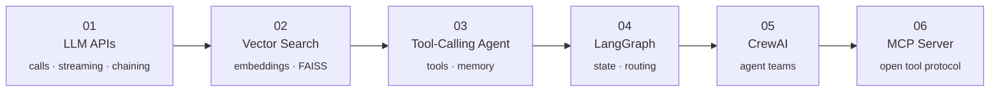
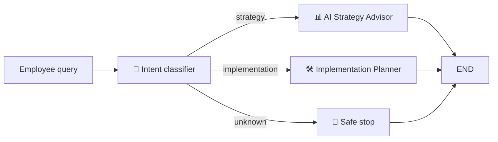
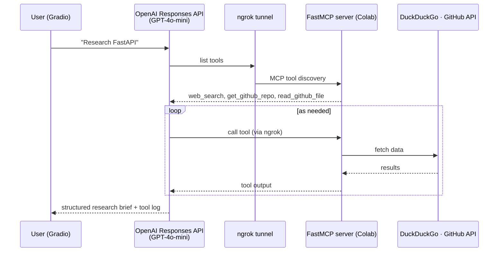

# 🤖 Agentic AI Journey: From LLM Calls to Multi-Agent Systems & MCP

-412991)

A hands-on path through the **agentic AI stack**, in six notebooks. It starts with a single LLM call and ends with a custom **Model Context Protocol (MCP) server** that GPT-4o-mini discovers and uses on its own. Each stage adds one capability: chaining, retrieval, tools, controlled routing, agent teams and open tool protocols.

| # | Notebook | Concept | Stack |
|---|----------|---------|-------|
| 01 | [LLM API basics](01_llm_api_basics/llm_api_basics.ipynb) | Calls, streaming, multi-step prompt chains | Groq · Llama 3.3 / 3.1 |
| 02 | [Vector search](02_rag_vector_search/faiss_vector_search.ipynb) | Embeddings, FAISS, filtering, MMR, Wikipedia indexing | LangChain · FAISS · HF embeddings |
| 03 | [Tool-calling agent](03_tool_calling_agent/tool_calling_agent.ipynb) | Agents that call real APIs, runtime context, memory | LangChain · Groq · Open-Meteo |
| 04 | [LangGraph routing](04_langgraph_routing/langgraph_routing.ipynb) | Explicit state + conditional edges | LangGraph · GPT-4o-mini |
| 05 | [CrewAI article generator](05_crewai_multi_agent/crewai_article_generator.ipynb) | Researcher → Writer → Editor crew, with a web UI | CrewAI · Serper · Gradio |
| 06 | [MCP server](06_mcp_server/mcp_server_gpt4o.ipynb) | Build an MCP server and connect an LLM to it | FastMCP · ngrok · OpenAI Responses API |

---

## 04 · LangGraph: An AI Enablement Advisor with Explicit Routing

Free-form agents decide their own next step. **LangGraph** lets *you* define the legal paths. An intent classifier labels each employee request, and a router sends it to the right specialist, or stops safely.

| Query | Routed to | Output |
|-------|-----------|--------|
| *"Should we adopt AI for our customer support operations this year?"* | **strategy** | Executive takeaway, business impact, risks, recommendation (*run a pilot first*), clarifying questions |
| *"How can we build an internal RAG system for HR policies?"* | **implementation** | Phased plan, from requirements to data prep, prototype and rollout, with privacy compliance |
| *"What is Elon Musk's wife's name?"* | **unknown** | Stops safely, with no off-topic answer |

The shared `AdvisorState` (query, intent, department, response log) flows through every node. Following *declare → compile → execute*, the routing logic is visible and testable instead of hidden inside a prompt.

---

## 05 · CrewAI: A Multi-Agent Article Generator

Three agents, each with a role, a goal and a backstory, work in sequence. Each one reads the previous agent's output as context.

- **Researcher:** searches the web and returns key facts with sources, recent developments, expert opinions and takeaways
- **Writer:** turns the research into a structured article in the requested tone and length
- **Editor:** polishes it for clarity and accuracy and removes editorial notes

**Test run:** *"The rise of AI agents in 2025"* (Tech Enthusiasts, informative, medium length) produced a full article, **"The Rise of AI Agents: A Transformative Shift by 2025"**, with sourced statistics such as the AI agent market growing from **$7.84B (2025) to $52.62B (2030)** (MarketsandMarkets) and McKinsey adoption figures.

A **Gradio UI** wraps the crew, with inputs for topic, audience, tone and length.

---

## 06 · MCP: Building a Server and Letting GPT-4o-mini Use It

The **Model Context Protocol** is an open standard for giving LLMs tools. Instead of hardcoding functions into one app, you run a **server** that any MCP-compatible client can discover and call.

**The server exposes three free tools:**

| Tool | Data source |
|------|-------------|
| `web_search` | DuckDuckGo |
| `get_github_repo` | GitHub REST API: stars, forks, topics, latest release |
| `read_github_file` | Raw file contents from public repos |

**Live result:** asked to research **FastAPI**, GPT-4o-mini discovered all three tools on its own and made **14 MCP tool calls**: 11 web searches, 2 GitHub repo lookups and 1 README read. It then produced a structured research brief. The direct tool test fetched `langchain-ai/langgraph` (29,404 stars at the time).

What makes this notable: the model was **never given function definitions in code**. It found the tools through the MCP protocol at a public URL.

---

## 01–03 · Foundations

**01 · LLM API basics:** first calls, streaming, and a three-step **prompt chain** (business area → pain point → agentic solution), the simplest form of a multi-step pipeline.

**02 · Vector search:** embeddings with `all-mpnet-base-v2`, a FAISS index with metadata filtering, similarity scores, MMR retrieval and deletion, then chunking and indexing real **Wikipedia** articles to search them. This is the retrieval half of RAG.

**03 · Tool-calling agent:** a LangChain agent that chains **two tools** (find the user's city from runtime context, then fetch **live weather** from Open-Meteo), remembers the conversation across turns with a checkpointer, and prints a trace of every tool call.

## 🧠 Key Ideas Across the Series

| Concept | Where |
|---------|-------|
| Prompt chaining | 01 |
| Embeddings & vector search | 02 |
| Tool calling & runtime context | 03, 06 |
| Conversation memory (checkpointers, thread IDs) | 03 |
| Explicit state & conditional routing | 04 |
| Role-based multi-agent collaboration | 05 |
| Open tool protocols (MCP) & tool discovery | 06 |
| Shipping agents behind a UI (Gradio) | 05, 06 |

## 🚀 Run It

Every notebook opens in Colab. Keys are read from **Colab Secrets** (🔑 icon in the left sidebar), so none are stored in the notebooks.

| Notebook | Keys needed |
|----------|-------------|
| 01, 03 | `GROQ_API_KEY` (free at [console.groq.com](https://console.groq.com/keys)) |
| 02 | None |
| 04 | `OPENAI_API_KEY` |
| 05 | `OPENAI_API_KEY`, `SERPER_API_KEY` (free at [serper.dev](https://serper.dev)) |
| 06 | `OPENAI_API_KEY`, `NGROK_AUTHTOKEN` (free at [ngrok.com](https://dashboard.ngrok.com)) |

## 🙏 Acknowledgements

Built while following an Agentic AI bootcamp and course labs, with examples adapted from the official LangChain, LangGraph, CrewAI and MCP documentation. Notebooks were cleaned, debugged and extended for this repository.

## 👤 Author

**Muhammad Mujtaba Khan Suri** — CS @ UBIT, University of Karachi
[GitHub](https://github.com/MMujtabaX)
